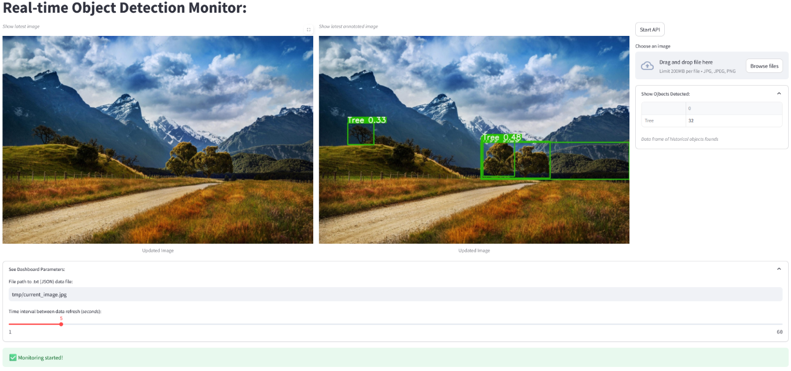

# Streamlit Dashboard with YOLO and Flask API for image uploads:



## How to run:

**Requirements:**
Install the dependencies, such as `PyTorch` as CPU or GPU (if you have CUDA GPU, and therefore ensure the matching **NVIDIA CUDA Toolkit** version is also installed prior to PyTorch).
```
pip install pandas streamlit ultralytics
```

**Run:**
```
streamlit run .\streamlit_yolo_sample.py --server.headless true  --server.port 81
```


## Features:

- Dashboard Features:
    - Input image into YOLO model. 
    - Show input image. 
    - Show annotated image saved from YOLO model. 
    - Display a pandas dataframe containing a count of the object labels, extracted from the image(s) by the YOLO model.
    - Dashboard parameters to specify:
      - (1) `filename path` of new images. Default = `./tmp/current_image.jpg` 
      - (2) `refresh interval` (in seconds) (reload the specified filename path image). Default = 5.
    - Buttons:
      - `Browse Files` - Upload a file from your device.
      - `Start API` -  Start / Stop the API to upload via HTTP requests.
- File Uploads:
    - Upload via file uploader.
- Flask API:
    - Start / Stop Flask API to upload via an API HTTP request at http://localhost:5000.
    - Find the `run_image_upload_to_api.bat` script which will send an image into the API.
    - The Flask process is started and stopped via the `subprocess` library, and its `processID`  is managed  within the Streamlit script, tracked using the `session_state` data structure.
- All image files stored into `./tmp/*.jpg`
    - Uploaded files stored as two copies `./tmp/<timestamp>_image.jpg`
    - A copy is stored as `./tmp/current_image.jpg` (loaded as default )